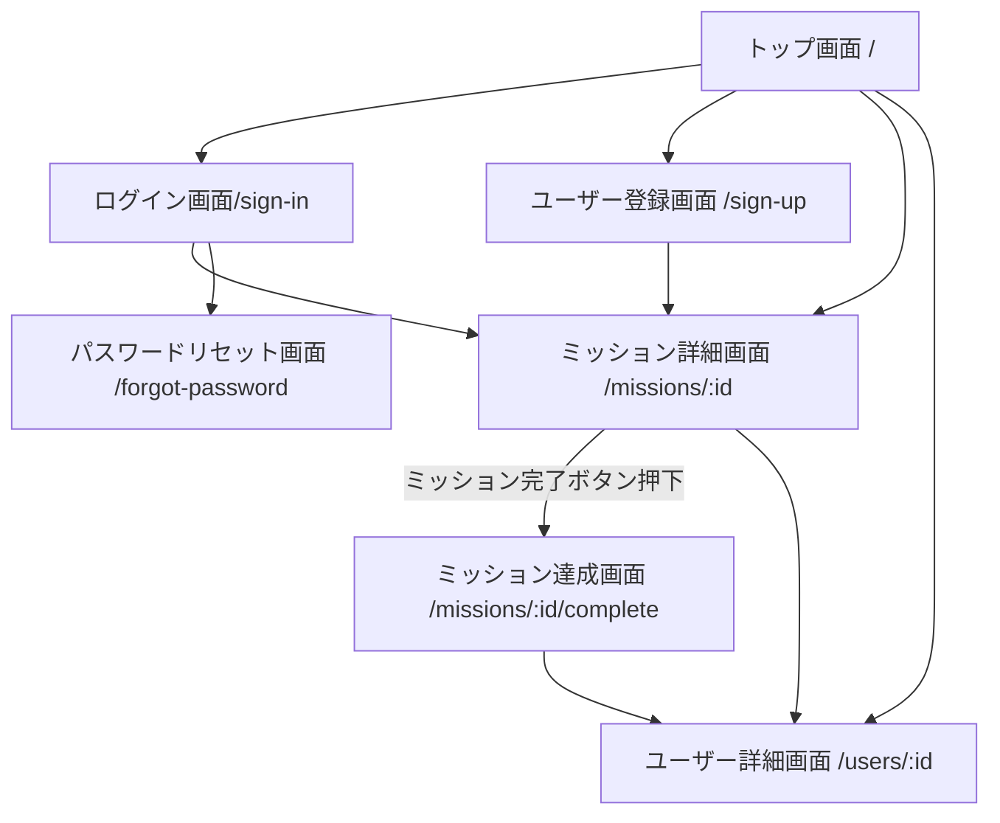

# サイトマップ

現状想定しているサービスの画面と、その画面遷移は以下。

```mermaid
flowchart TD
  top[トップ画面 /]
  signin[ログイン画面/sign-in]
  signup[ユーザー登録画面 /sign-up]
  forgot[パスワードリセット画面 /forgot-password]
  mission[ミッション詳細画面 /missions/:id]
  complete[ミッション達成画面 /missions/:id/complete]
  user[ユーザー詳細画面 /users/:id]

  top --> signin
  top --> signup
  top --> mission
  top --> user

  signin --> mission
  signin --> forgot
  signup --> mission

  mission --ミッション完了ボタン押下--> complete
  mission --> user

  complete --> user
```