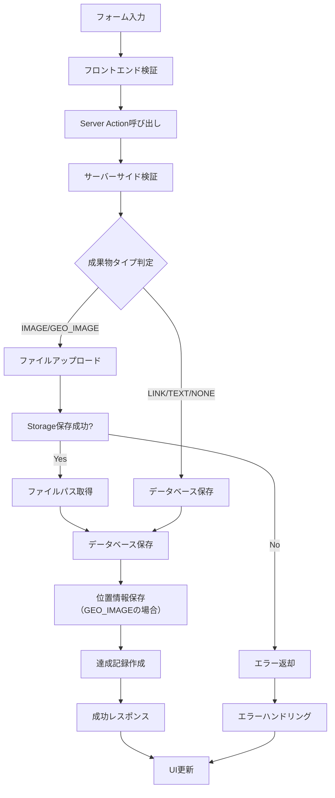
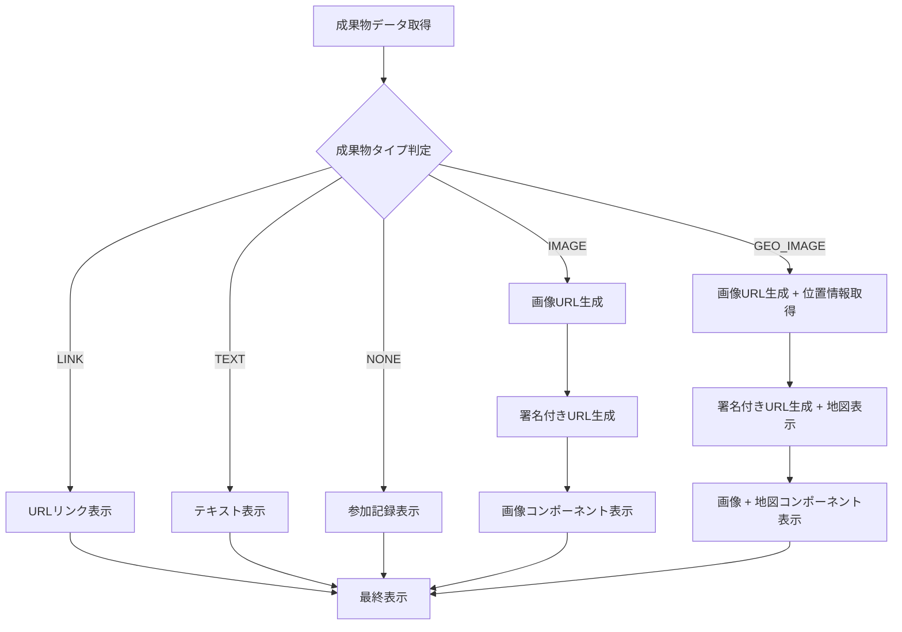

# 成果物システム詳細仕様

## 概要

Action Boardの成果物システムは、ユーザーがミッションを達成した際に提出する成果物を管理する中核システムです。5つの異なるタイプの成果物に対応し、それぞれに適したバリデーションと保存方式を提供します。

## 成果物タイプ

### 1. LINK（リンク型）
```typescript
type LinkArtifact = {
  type: 'LINK';
  url: string; // 必須
  text_content: null;
  file_path: null;
}
```

**用途**: 外部サイト、SNS投稿、オンライン成果物への参照
**バリデーション**: URL形式の検証、リーチャビリティチェック
**表示方式**: クリック可能なリンクとして表示

### 2. TEXT（テキスト型）
```typescript
type TextArtifact = {
  type: 'TEXT';
  url: null;
  text_content: string; // 必須
  file_path: null;
}
```

**用途**: 感想文、レポート、コメント等のテキスト成果物
**バリデーション**: 文字数制限、不適切コンテンツフィルタ
**表示方式**: フォーマット済みテキストとして表示

### 3. IMAGE（画像型）
```typescript
type ImageArtifact = {
  type: 'IMAGE';
  url: null;
  text_content: null;
  file_path: string; // 必須
}
```

**用途**: 写真、スクリーンショット、図表等の画像成果物
**バリデーション**: 画像形式チェック（JPEG, PNG, WebP）、サイズ制限
**表示方式**: 最適化された画像として表示
**ストレージ**: Supabase Storage buckets

### 4. IMAGE_WITH_GEOLOCATION（位置情報付き画像型）
```typescript
type GeoImageArtifact = {
  type: 'IMAGE_WITH_GEOLOCATION';
  url: null;
  text_content: null;
  file_path: string; // 必須
  geolocation: {
    latitude: number;
    longitude: number;
    accuracy?: number;
    altitude?: number;
  };
}
```

**用途**: 現地訪問の証明、イベント参加証明等の位置情報が重要な画像
**バリデーション**: 画像バリデーション + GPS座標の有効性チェック
**表示方式**: 画像 + 地図表示
**ストレージ**: 画像はSupabase Storage、位置情報は`mission_artifact_geolocations`テーブル

### 5. NONE（成果物不要型）
```typescript
type NoneArtifact = {
  type: 'NONE';
  url: null;
  text_content: null;
  file_path: null;
}
```

**用途**: 参加自体が成果となるミッション（セミナー参加等）
**バリデーション**: なし（参加記録のみ）
**表示方式**: 参加記録として表示

## データベース設計

### メインテーブル: `mission_artifacts`
```sql
CREATE TABLE mission_artifacts (
  id uuid PRIMARY KEY DEFAULT gen_random_uuid(),
  user_id uuid REFERENCES users(id) ON DELETE CASCADE,
  mission_id uuid REFERENCES missions(id) ON DELETE CASCADE,
  artifact_type artifact_type_enum NOT NULL,
  url text,
  text_content text,
  file_path text,
  created_at timestamptz DEFAULT now(),
  updated_at timestamptz DEFAULT now(),
  
  -- 整合性制約
  CONSTRAINT valid_link_artifact CHECK (
    (artifact_type = 'LINK' AND url IS NOT NULL AND text_content IS NULL AND file_path IS NULL) OR
    artifact_type != 'LINK'
  ),
  CONSTRAINT valid_text_artifact CHECK (
    (artifact_type = 'TEXT' AND url IS NULL AND text_content IS NOT NULL AND file_path IS NULL) OR
    artifact_type != 'TEXT'
  ),
  CONSTRAINT valid_image_artifact CHECK (
    (artifact_type = 'IMAGE' AND url IS NULL AND text_content IS NULL AND file_path IS NOT NULL) OR
    artifact_type != 'IMAGE'
  ),
  CONSTRAINT valid_image_with_geolocation_artifact CHECK (
    (artifact_type = 'IMAGE_WITH_GEOLOCATION' AND url IS NULL AND text_content IS NULL AND file_path IS NOT NULL) OR
    artifact_type != 'IMAGE_WITH_GEOLOCATION'
  ),
  CONSTRAINT valid_none_artifact CHECK (
    (artifact_type = 'NONE' AND url IS NULL AND text_content IS NULL AND file_path IS NULL) OR
    artifact_type != 'NONE'
  )
);
```

### 位置情報テーブル: `mission_artifact_geolocations`
```sql
CREATE TABLE mission_artifact_geolocations (
  id uuid PRIMARY KEY DEFAULT gen_random_uuid(),
  artifact_id uuid REFERENCES mission_artifacts(id) ON DELETE CASCADE,
  latitude double precision NOT NULL,
  longitude double precision NOT NULL,
  accuracy double precision,
  altitude double precision,
  created_at timestamptz DEFAULT now()
);
```

## 処理フロー

### 成果物提出フロー


### 成果物表示フロー


## セキュリティ考慮事項

### Row Level Security (RLS)
```sql
-- 成果物の読み取りポリシー
CREATE POLICY "Users can view their own artifacts" ON mission_artifacts
  FOR SELECT USING (auth.uid() = user_id);

-- 成果物の作成ポリシー
CREATE POLICY "Users can create their own artifacts" ON mission_artifacts
  FOR INSERT WITH CHECK (auth.uid() = user_id);

-- 成果物の更新ポリシー
CREATE POLICY "Users can update their own artifacts" ON mission_artifacts
  FOR UPDATE USING (auth.uid() = user_id);

-- 成果物の削除ポリシー
CREATE POLICY "Users can delete their own artifacts" ON mission_artifacts
  FOR DELETE USING (auth.uid() = user_id);
```

### ファイル保存セキュリティ
- **Storage Bucket Policy**: 認証済みユーザーのみアップロード可能
- **ファイル形式制限**: 画像ファイルのみ許可
- **サイズ制限**: 最大10MBまで
- **署名付きURL**: 一定時間後に自動失効

## パフォーマンス最適化

### 画像最適化
- **Next.js Image Component**: 自動的なWebP変換とサイズ最適化
- **Progressive Loading**: プレースホルダー表示
- **CDN配信**: Supabase CDNによる高速配信

### データ取得最適化
- **必要な成果物のみ取得**: ページネーション
- **関連データの事前読み込み**: 位置情報の効率的取得
- **キャッシュ戦略**: 画像URLのキャッシュ

## エラーハンドリング

### 一般的なエラーパターン
1. **バリデーションエラー**: 不適切な成果物形式
2. **アップロードエラー**: ファイル保存失敗
3. **権限エラー**: 他ユーザーの成果物編集試行
4. **ネットワークエラー**: 一時的な接続問題

### エラー対応策
- **リトライ機能**: 一時的なエラーの自動再試行
- **ユーザーフレンドリーなメッセージ**: 技術用語を避けた説明
- **部分的な保存**: 可能な部分は保存して後で修正可能に

## 今後の拡張予定

### 短期的な改善
- **プレビュー機能**: 提出前の成果物プレビュー
- **一括削除**: 複数成果物の一括管理
- **編集機能**: 提出後の成果物修正

### 長期的な拡張
- **動画対応**: VIDEO型成果物の追加
- **音声対応**: AUDIO型成果物の追加
- **ファイル共有**: 他ユーザーとの成果物共有機能
- **AI検証**: 成果物の自動品質チェック

---

**最終更新**: 2024年12月19日
**実装ステータス**: 基本機能完成、拡張機能計画中
